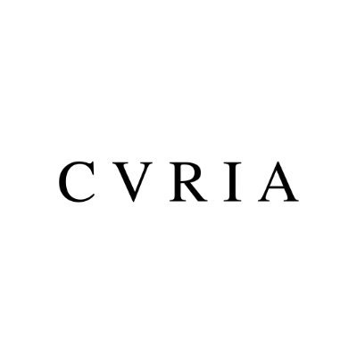

# Curia Core • [](https://github.com/kalidao/multi-sig/actions/workflows/tests.yml)   

Curia Collective Core Contracts.

## Blueprint

```ml
lib
├─ ds-test — https://github.com/dapphub/ds-test
├─ forge-std — https://github.com/brockelmore/forge-std
src
├─ tests
│  └─ ...
├─ LexLocker — "Resolveable, yield-bearing deal escrow for ETH and ERC-20/721 tokens"
```
## Development

[Curia Core](https://github.com/curia-collective/core) is built with [Foundry](https://github.com/gakonst/foundry).

**Setup**
```bash
forge install
```

**Building**
```bash
forge build
```

**Testing**
```bash
forge test
```

**Configure Foundry**

Using [foundry.toml](./foundry.toml), Foundry is easily configurable.

For a full list of configuration options, see the Foundry [configuration documentation](https://github.com/gakonst/foundry/blob/master/config/README.md#all-options).

## License

[AGPL-3.0-only](https://github.com/abigger87/femplate/blob/master/LICENSE)

## Disclaimer

_These smart contracts are being provided as is. No guarantee, representation or warranty is being made, express or implied, as to the safety or correctness of the user interface or the smart contracts. They have not been audited and as such there can be no assurance they will work as intended, and users may experience delays, failures, errors, omissions, loss of transmitted information or loss of funds. The creators are not liable for any of the foregoing. Users should proceed with caution and use at their own risk._
